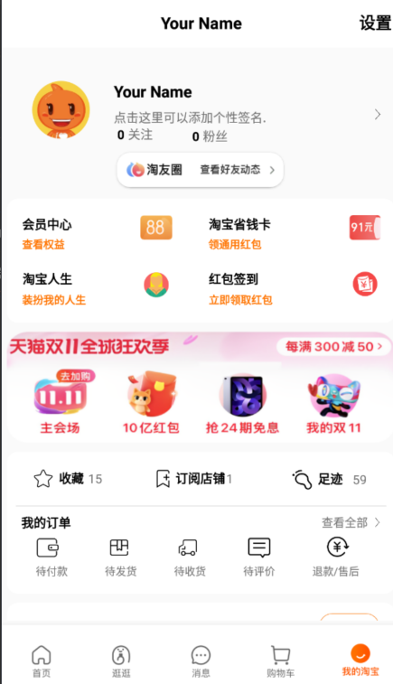
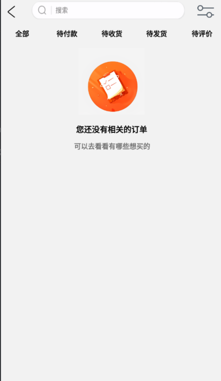

# TaoBao
## 实现了大致的淘宝UI仿写
1.在BottomNavigationView上面搭建了五个简单的淘宝界面  
2.界面上的数据都是死数据，没有申请API，只是简单的页面仿写  
3.下面开始简单介绍各个界面，以及效果
## 我的淘宝

  
- 在NestScrollView中include各个分布局，实现了轮播广告，个人主页，退款售后，待付款..几个简单的界面
## 购物车
- 购物车界面是一个简单的RecyclerView
